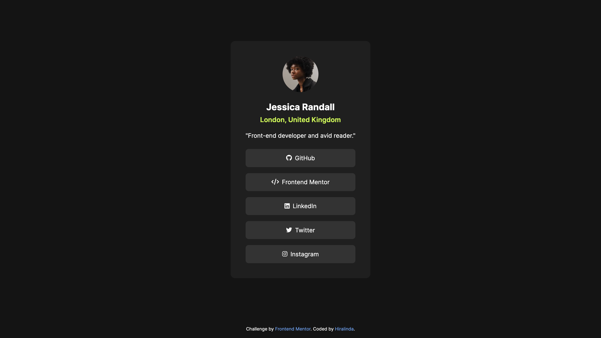
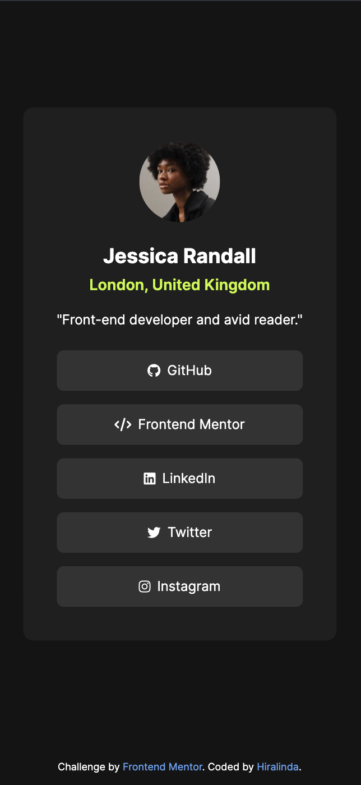

# Frontend Mentor - Social Links Profile

This is my solution to the [Social Links Profile challenge on Frontend Mentor](https://www.frontendmentor.io/challenges/social-links-profile-UG32l9m6dQ) built with HTML and Tailwind CSS.

## Table of contents

- [Overview](#overview)
  - [Screenshot](#screenshot)
  - [Links](#links)
- [My process](#my-process)
  - [Built with](#built-with)
  - [What I learned](#what-i-learned)
  - [Continued development](#continued-development)
  - [Useful resources](#useful-resources)
- [Author](#author)
- [Acknowledgments](#acknowledgments)

## Overview

This project is a responsive Social Links Profile card built as a solution to the [Social Links Profile challenge on Frontend Mentor](https://www.frontendmentor.io/challenges/social-links-profile-UG32l9m6dQ). It showcases a clean, centered design featuring a profile image, personal information, and social media links, demonstrating skills in HTML, Tailwind CSS, and responsive web design.

### Screenshot

### Links

- Live Site URL: [Social Links Profile Live Site](https://hiralinda.github.io/social-links-profile-main/)

## My process

### Built with

- HTML5
- [Tailwind CSS](https://tailwindcss.com/) - For styles
- Flexbox
- Mobile-first workflow
- [Font Awesome](https://fontawesome.com/) - For icons

### What I learned

This project helped reinforce my understanding of:

- Implementing designs using Tailwind CSS utility classes
- Creating responsive layouts with Flexbox
- Integrating custom fonts and icons into a web page
- Structuring semantic HTML for accessibility and SEO
- Applying hover effects and transitions for interactive elements

### Continued development

In future projects, I'd like to focus on:

- Exploring more advanced Tailwind CSS features and customizations
- Implementing JavaScript functionality to enhance interactivity
- Improving accessibility features and best practices
- Learning to integrate this component into a larger web application

### Useful resources

- [Tailwind CSS Documentation](https://tailwindcss.com/docs): This resource was invaluable for learning how to effectively use Tailwind's utility classes and customize the design.
- [Font Awesome Documentation](https://fontawesome.com/docs): Helped with integrating and styling the social media icons.
- [MDN Web Docs](https://developer.mozilla.org/): A great resource for HTML and CSS fundamentals.
- [Frontend Mentor](https://www.frontendmentor.io): The challenge itself provided great practice for implementing designs and improving front-end skills.

## Author

- Frontend Mentor - [@hiralinda](https://www.frontendmentor.io/profile/hiralinda)

## Acknowledgments

Thanks to Frontend Mentor for providing this challenge and to the online developer community for their invaluable resources and support. Special thanks to the Tailwind CSS team for creating such a powerful and developer-friendly tool.
